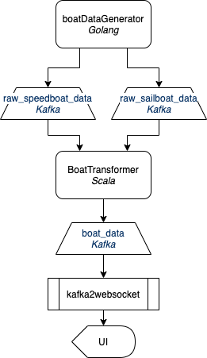

# go-crash

This is a little toy project we made to learn about Golang, Kafka, Flink, and Scala. The general thought is this:
1. There are 2 types of boats. Speedboats will send a name, timestamp, position, and velocity. Sailboats will only send name, timestamp, and position.
1. The speedboats and sailboats send their data on different Kafka topics.
1. Use Flink to stream data as it is generated and put it on another topic. This should include the boat name, timestamp, position, velocity, heading, type, and whether they are about to collide with another boat.
1. Display a UI that color-codes the boats based on type. Also indicate if they are on a collision course.

# Architecture Diagram


# Running the Demo

## Prerequisites:
Install Docker
```
brew cask install docker
```
Install Parcel Bundler:
```
npm install -g parcel-bundler
```
Install Scala 2.12.x and sbt

## Running Kafka:
Clone the repository:
```
git clone git@github.com:wurstmeister/kafka-docker.git
```

In `docker-compose-single-broker.yaml` change the value of `KAFKA_ADVERTISTED_HOST_NAME` on line 12 to `localhost`, like this:
```
KAFKA_ADVERTISED_HOST_NAME: localhost
```

In `docker-compose-single-broker.yaml` change the value of `KAFKA_CREATE_TOPICS` on line 13 to the following:
```
KAFKA_CREATE_TOPICS: raw_speedboat_data:1:1,raw_sailboat_data:1:1,boat_data:1:1
```

Start Kafka-docker:
```
docker-compose -f docker-compose-single-broker.yml up -d
```

## Start the boat data processor:
```
cd scala/scala-crash
sbt run
```

## Build and Start kafka2websocket

```
brew install openssl

cd dashboard/kafka2websocket/k2ws

CFLAGS="-I/usr/local/opt/openssl/include"
LDFLAGS="-L/usr/local/opt/openssl/lib"
go build -tags static

./k2ws
```

After running this command, you should be able to hit the k2ws test page at http://localhost:8080/test. Click "Open" on the top bar to open the websocket connection. If you run the boat data generator, you should see messages coming in on this window.

## Start Web GUI
```
cd dashboard/frontend
parcel index.html
```

You should now be able to hit `http://localhost:1234` and see the Boat GUI.

## Start Boat Data generator:
Now you can run the boat data generator, and watch the boats move on the map.
```
go run cmd/boatDataGenerator/main.go
```
